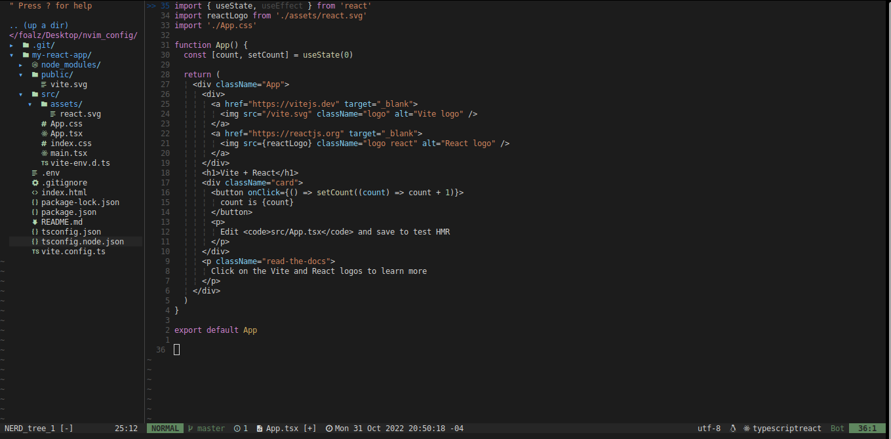
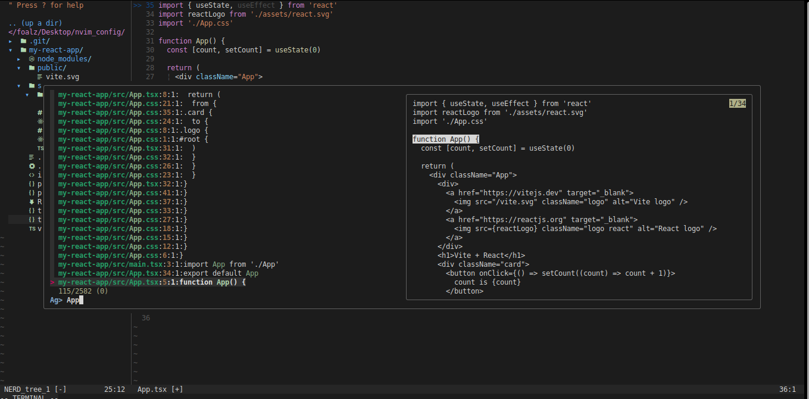

# Configuracion Neovim 0.7.2 con Lua 

## Screenshots

## Importante

Instalar el gestor de paquetes [packer.nvim](https://github.com/wbthomason/packer.nvim).
Instalar las dependencias de [the_silver_searcher](https://github.com/ggreer/the_silver_searcher).

