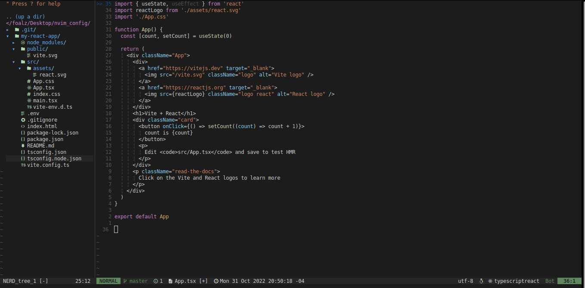
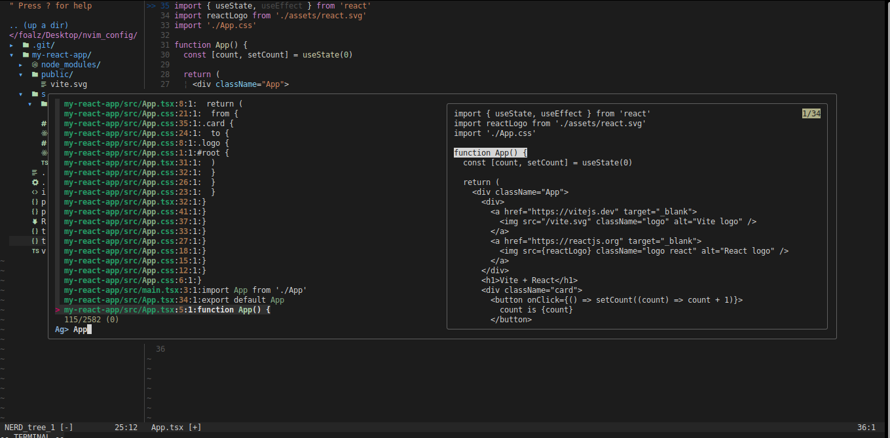

# Configuracion Neovim con Lua

## Screenshots





## Requisitos Previos

### Fuente Nerd Font (Requerida para iconos)

Esta configuración utiliza iconos especiales que requieren una **Nerd Font**. Si los iconos aparecen como signos de interrogación (?) o cuadros vacíos, debes:

1. **Descargar una Nerd Font** desde [nerdfonts.com](https://www.nerdfonts.com/font-downloads)
   - Recomendadas: `JetBrainsMono Nerd Font`, `FiraCode Nerd Font`, o `Hack Nerd Font`

2. **Instalar la fuente en tu sistema**:
   - **Windows**: Descarga el archivo `.zip`, extrae y haz doble clic en los archivos `.ttf` para instalar
   - **Linux**: Copia los archivos `.ttf` a `~/.local/share/fonts/` y ejecuta `fc-cache -fv`
   - **macOS**: Copia los archivos `.ttf` a `~/Library/Fonts/`

3. **Configurar tu terminal para usar la Nerd Font**:
   - **Windows Terminal (WSL)**: Settings → Profiles → Defaults → Appearance → Font face → Selecciona tu Nerd Font
   - **iTerm2**: Preferences → Profiles → Text → Font → Selecciona tu Nerd Font
   - **Alacritty**: Edita `alacritty.yml` y configura `font.normal.family`

## Importante

- Instalar el gestor de paquetes [packer.nvim](https://github.com/wbthomason/packer.nvim)<br>
- Instalar [Ripgrep](https://github.com/burntsushi/ripgrep) para que Telescope pueda funcionar correctamente.
- Instalar [LazyGit](https://github.com/jesseduffield/lazygit#installation) para que funcione el plugin de git.
- Instalar [Glow](https://github.com/charmbracelet/glow) para el preview de Markdown en terminal.
- Instalar [Herdr](https://herdr.dev) como multiplexor de terminal.
- Instalar [ruff](https://docs.astral.sh/ruff/) para el linter PEP8 de Python (ver sección "Python Linting").
- Recordar siempre colocar este comando para que el plugin CoC funcione correctamente: `:CocInstall coc-json coc-tsserver`.

## Instalación

### Automática (recomendada)

```bash
git clone https://github.com/Foalz/myNvimConfig.git ~/.config/nvim
cd ~/.config/nvim
./install.sh
```

El script instala todas las dependencias (Neovim, Node.js, Ripgrep, LazyGit, Glow, Herdr, Ruff, Packer), copia la configuración, descarga los plugins y las extensiones de CoC. Soporta apt, dnf, pacman y brew.

### Manual

1. Clona este repositorio:
   ```bash
   git clone https://github.com/Foalz/myNvimConfig.git ~/.config/nvim
   ```

2. Instala las dependencias: Neovim, Node.js, Ripgrep, LazyGit, Herdr, Ruff (ver sección "Importante").

3. Instala [packer.nvim](https://github.com/wbthomason/packer.nvim):
   ```bash
   git clone --depth 1 https://github.com/wbthomason/packer.nvim \
     ~/.local/share/nvim/site/pack/packer/start/packer.nvim
   ```

4. Abre Neovim y ejecuta:
   ```vim
   :PackerSync
   ```

5. Reinicia Neovim para aplicar todos los plugins.

## Python Linting (PEP8)

Esta configuración incluye linting PEP8 para Python usando **Pyright** (autocompletado y tipos) + **Ruff** (linter y formateador), integrados vía CoC.

### Dependencias

| Herramienta | Rol | Instalación |
|---|---|---|
| `coc-pyright` | LSP de Python (autocompletado, tipos, go-to-definition) | `:CocInstall coc-pyright` |
| `coc-diagnostic` | Puente entre linters externos y CoC | `:CocInstall coc-diagnostic` |
| `ruff` | Linter PEP8 + formateador | `pipx install ruff` |

### Instalación

1. Instalar `ruff`:
   ```bash
   # Opción recomendada (aislado con pipx)
   sudo apt install -y pipx && pipx ensurepath && pipx install ruff

   # Alternativa directa
   pip install --break-system-packages ruff
   ```

2. Instalar las extensiones de CoC dentro de Neovim:
   ```vim
   :CocInstall coc-pyright coc-diagnostic
   ```

3. Reiniciar Neovim. Al abrir un archivo `.py`, los errores PEP8 aparecerán inline.

### Uso

- **Errores inline**: se muestran automáticamente al abrir/guardar archivos `.py`.
- **Formatear con Ruff**: `:call CocAction('format')` aplica el formateador de Ruff al buffer actual.
- **Ver diagnósticos**: `:CocDiagnostics` lista todos los errores del archivo.

### Reglas activas por defecto

La configuración en `coc-settings.json` activa las siguientes reglas de ruff:

| Código | Descripción |
|---|---|
| **E** | Errores PEP8 (incluye `E501` line too long, default 88 chars) |
| **W** | Warnings PEP8 |
| **F** | Pyflakes (variables/imports sin usar, etc.) |
| **I** | isort (orden de imports) |

### Configuración personalizada de Ruff por proyecto

Para ajustar las reglas de linting en un proyecto específico, crear un archivo `ruff.toml` o `pyproject.toml` en la raíz del proyecto:

```toml
# ruff.toml
line-length = 120

[lint]
select = ["E", "W", "F", "I"]
ignore = ["E501"]               # ignorar largo de línea si ya usás 120
```

## Plugins

| Plugin | Función | Keymaps principales |
|---|---|---|
| [coc.nvim](https://github.com/neoclide/coc.nvim) | Autocompletado y LSP (Pyright, JSON, XML, YAML, HTML) | Configurado vía `coc-settings.json` |
| [telescope.nvim](https://github.com/nvim-telescope/telescope.nvim) | Buscador fuzzy de archivos, texto y buffers | `<leader>ff` archivos, `<leader>fg` grep, `<leader>fb` buffers |
| [neo-tree.nvim](https://github.com/nvim-neo-tree/neo-tree.nvim) | Explorador de archivos | `<leader>nn` abrir, `\` reveal |
| [nvim-treesitter](https://github.com/nvim-treesitter/nvim-treesitter) | Syntax highlighting semántico y parsing de código | Auto-instala parsers al abrir archivos |
| [flash.nvim](https://github.com/folke/flash.nvim) | Salto rápido a cualquier posición visible | `gl` saltar, `gL` seleccionar por nodo TreeSitter |
| [which-key.nvim](https://github.com/folke/which-key.nvim) | Popup con keybindings disponibles al presionar un prefijo | Presionar `<leader>` y esperar |
| [todo-comments.nvim](https://github.com/folke/todo-comments.nvim) | Resalta y busca TODO/FIXME/HACK/NOTE en el proyecto | `<leader>ft` buscar TODOs, `]t`/`[t` navegar |
| [toggleterm.nvim](https://github.com/akinsho/toggleterm.nvim) | Terminales integradas y LazyGit flotante | `1<leader>t` vertical, `2<leader>t` horizontal, `3<leader>t` float, `<leader>lg` LazyGit |
| [gitsigns.nvim](https://github.com/lewis6991/gitsigns.nvim) | Indicadores de cambios git en el margen + blame inline | `<leader>gp` preview, `<leader>gb` blame, `<leader>gs` stage, `]c`/`[c` navegar hunks |
| [diffview.nvim](https://github.com/sindrets/diffview.nvim) | Vista diff de todos los archivos modificados | `<leader>gd` abrir, `<leader>gq` cerrar, `<leader>gh` historial |
| [git-conflict.nvim](https://github.com/akinsho/git-conflict.nvim) | Resolver conflictos de merge dentro del buffer | Atajos inline al detectar conflicto |
| [lualine.nvim](https://github.com/nvim-lualine/lualine.nvim) | Barra de estado | Automático |
| [vim-surround](https://github.com/tpope/vim-surround) | Manejo de delimitadores (quotes, brackets, tags) | `cs"'` cambiar `"` por `'`, `ds"` borrar, `ysiw"` agregar |
| [nvim-autopairs](https://github.com/windwp/nvim-autopairs) | Cierre automático de paréntesis, llaves, etc. | Automático |
| [nerdcommenter](https://github.com/preservim/nerdcommenter) | Comentar/descomentar líneas | `<leader>cc` comentar, `<leader>cu` descomentar |
| [glow.nvim](https://github.com/ellisonleao/glow.nvim) | Preview de Markdown renderizado en ventana flotante | `<leader>md` abrir preview |
| [csv.vim](https://github.com/chrisbra/csv.vim) | Soporte para archivos CSV | Automático al abrir `.csv` |

## Notas técnicas

### Telescope en master (no 0.1.x)

Telescope se configura apuntando a `master` en vez de la rama `0.1.x` o un tag fijo. Esto es necesario porque Neovim 0.11+ eliminó `vim.treesitter.language.ft_to_lang()` y la rama `0.1.x` aún usa esa función deprecada en el previewer, lo que causa el error:

```
attempt to call field 'ft_to_lang' (a nil value)
```

La rama `master` usa `vim.treesitter.language.get_lang()` que es la API correcta para Neovim >= 0.11.

## Solución de Problemas

### Error: `module 'nvim-treesitter.configs' not found`

Este error ocurre cuando los plugins aún no están instalados. Ejecuta:
```vim
:PackerSync
```
Luego reinicia Neovim.

### Iconos no se muestran correctamente

Asegúrate de tener instalada y configurada una Nerd Font en tu terminal (ver sección "Requisitos Previos").
